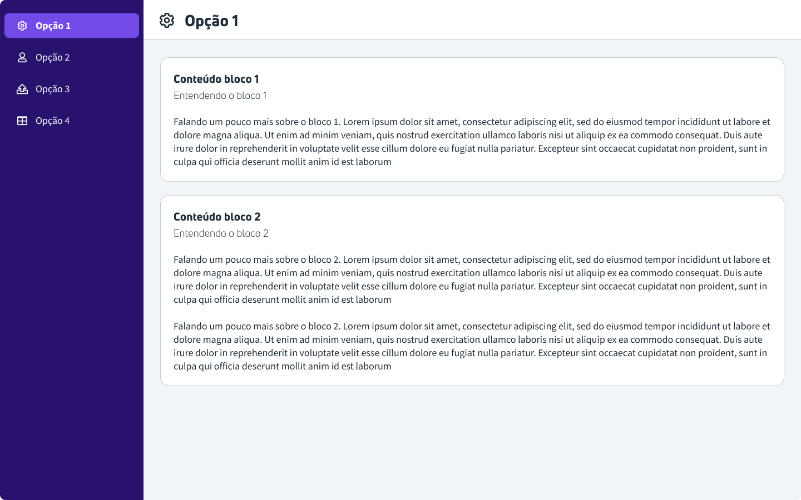

# Desafio de frontend *HTML* + *CSS*

- [Índice](#indice)
  - [Descrição do desafio](#desafio)
  - [Ir para o desafio de backend](../backend/README.md)
  - [Ir para o desafio de frontend](../frontend/README.md)

## Desafio

O desafio consiste em você criar uma interface igual a essa da imagem abaixo utilizando somente *HTML* e *CSS*.

Nós avaliaremos o visual, a estrutura do *HTML* e a forma com que usou o *CSS*.

Você deve alterar somente os arquivos [index.html](index.html) e [style.css](style.css).
